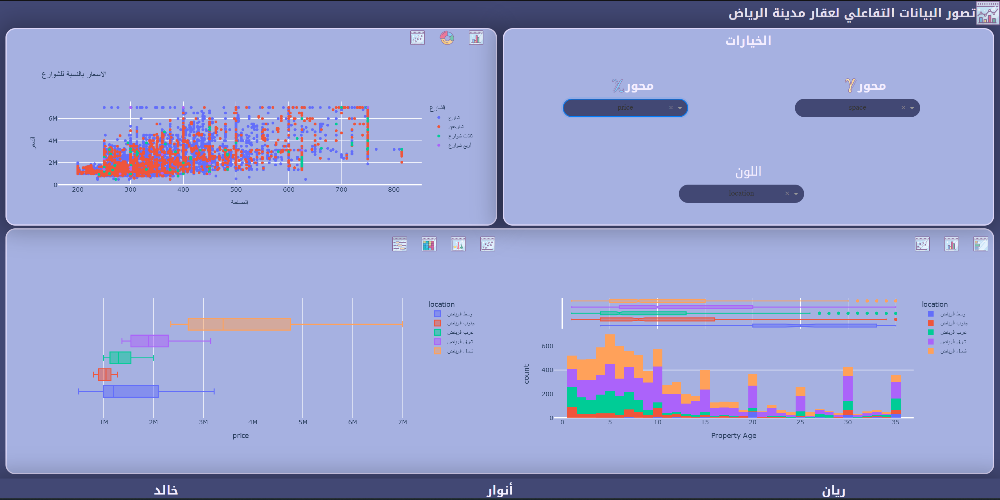
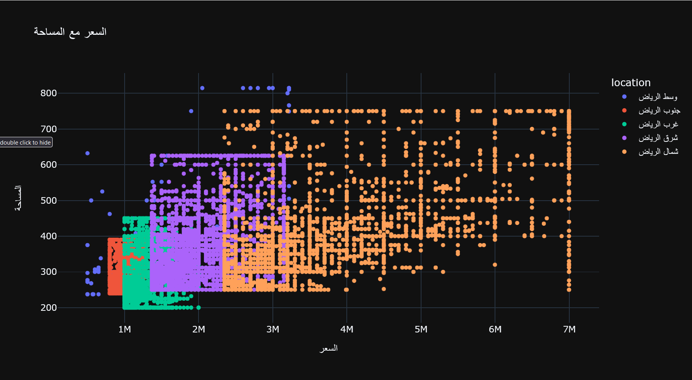
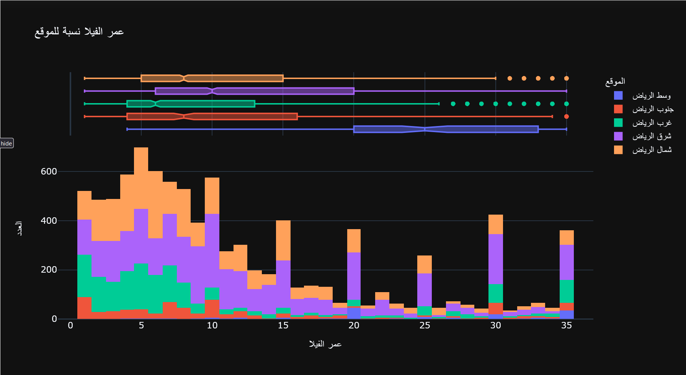
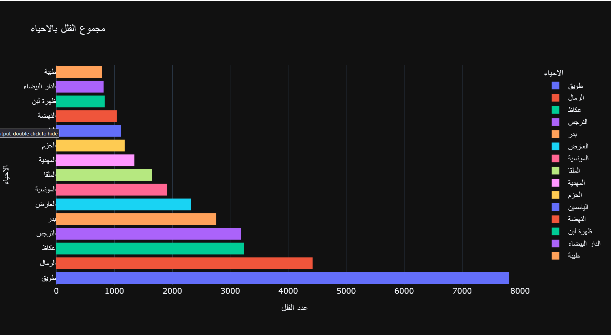
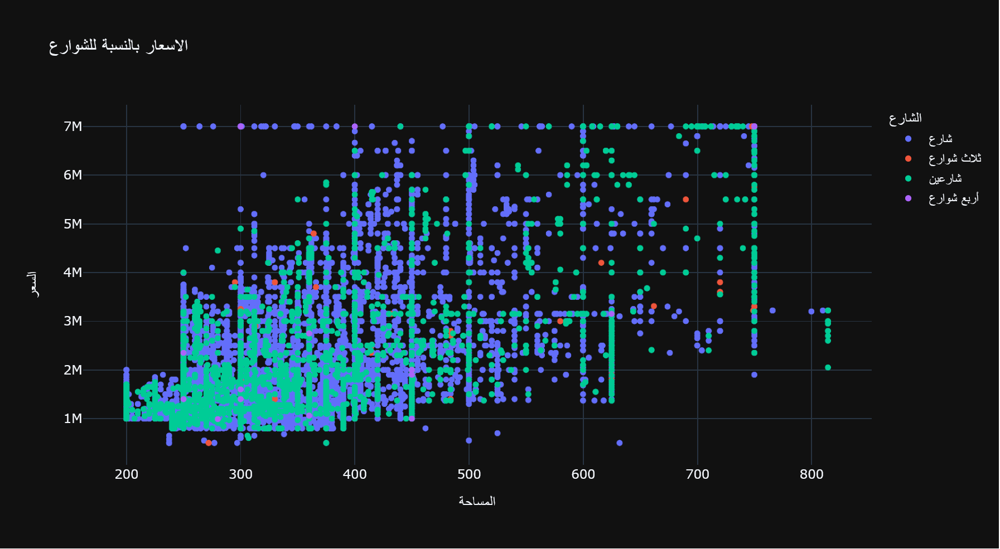
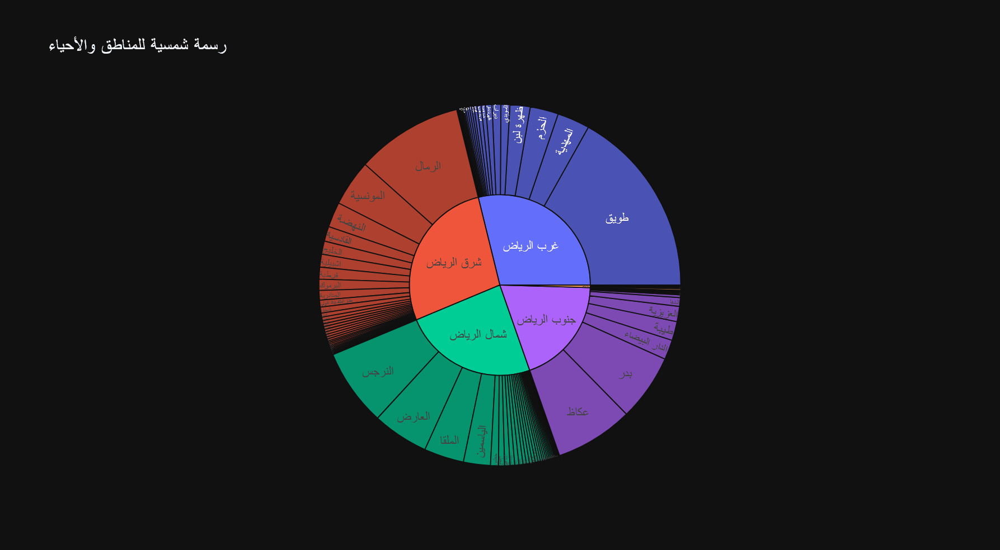
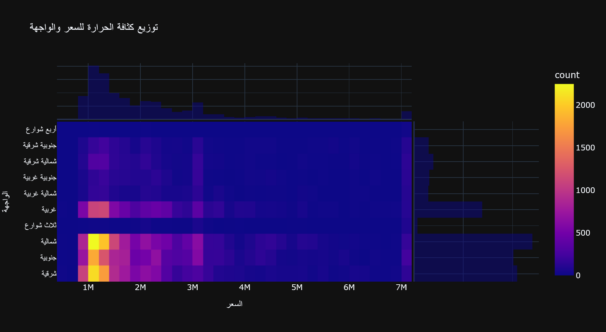
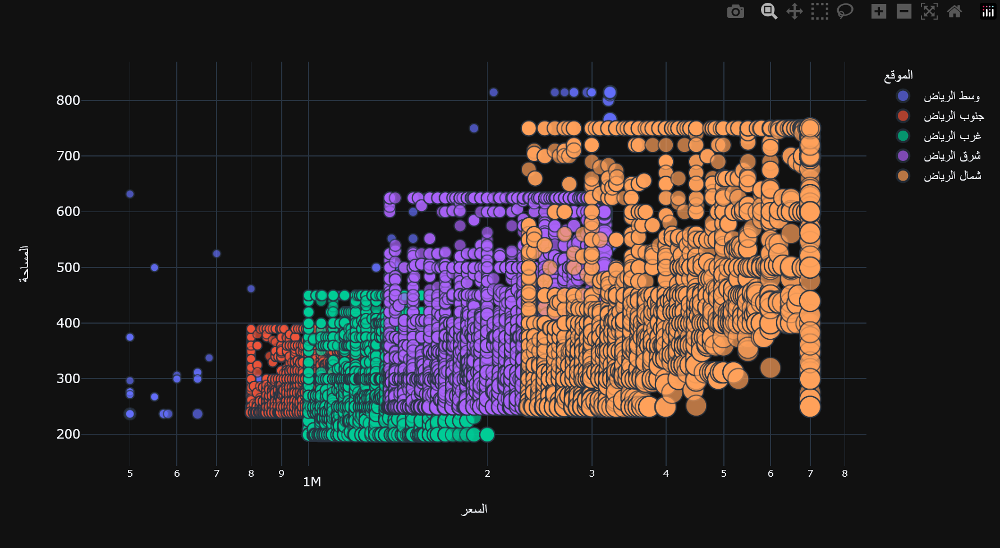
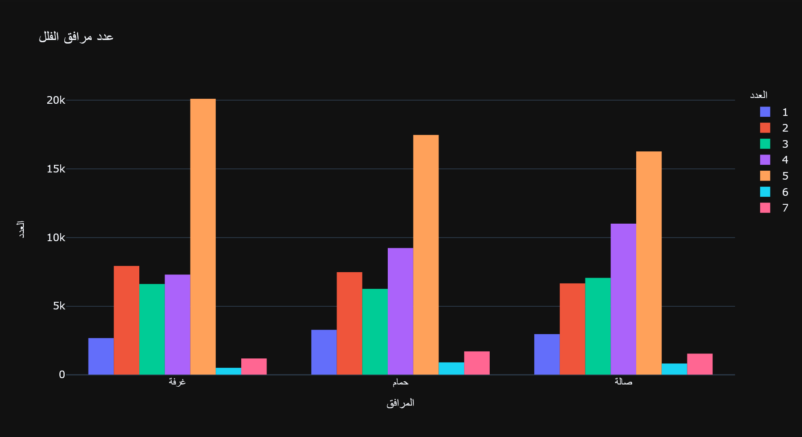

# تصور البيانات التفاعلي
---

## المقدمة

يتعلق المشروع بإنشاء لوحة تصور بيانات تفاعلية باستخدام [Dash](https://plotly.com/dash/). باستخدام [Riyadh Villas Aqar](https://www.kaggle.com/datasets/reemamuhammed/riyadh-villas-aqar)، تمكنا من إنشاء لوحة تحكم تفاعلية جيدة جدًا!.
تحتوي مجموعة البيانات على العديد من الأعمدة، وتحتاج إلى قليل من التنظيف والمعالجة المسبقة، سنتعامل مع ذلك في لحظة.

## أعضاء الفريق والمهام

|  *أنوار المطلق* | *خالد الحميدان* |  *ريان بغدادي*  | المهام
|:----------------:|:----------------:|:----------------:|:-------:|
|                  |:white_check_mark:|                  | *EDA* |
|:white_check_mark:|:white_check_mark:|:white_check_mark:| *Cleaning* |
|:white_check_mark:|:white_check_mark:|:white_check_mark:| *Data Visualization* |
|:white_check_mark:|                  |                  | *Dash-Design* |
|                  |                  |:white_check_mark:| *Dash-HTML* |
|:white_check_mark:|                  |:white_check_mark:| *Dahs-CSS* |
|                  |:white_check_mark:|                  | *Dash-Callbacks* |
|:white_check_mark:|:white_check_mark:|:white_check_mark:| *README File* |

## المشاكل في مجموعة البيانات:

## الرؤى:

<H1></H1>

<H1></H1>

<H1></H1>

<H1></H1>

<H1></H1>

<H1></H1>

<H1></H1>

<H1></H1>

<H1></H1>

<H1></H1>

